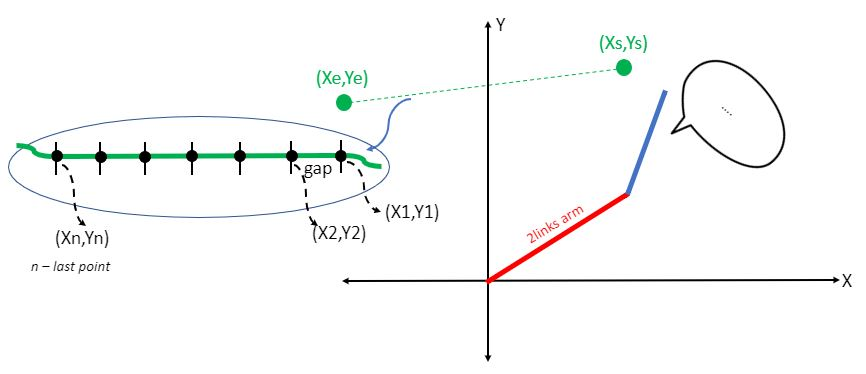

# 2DOF-Robot-Arm

This project is just a proof of the concept of constant velocity of robot's end-effector motion. This two links robot arm is able to move in approximated straight line in X and Y axes with desired speed. For example, we can give an input like starting point (Xs,Ys) and end point (Xe,Ye) in unit of millimeters, and how much speed you want to travel as i.e. 10mm/s, 30mm/s, 50mm/s and so on. I chose this 2DOF configuration because it's the most simplest form of the robot manipulator that you might see when we were studying Robotics Class. The idea of this will be extended to other configuration as 4DOF palletizer and 6DOF general robots.


# Concept
This two linkage mechanism can move in each individual joint space. To make it move to some specific point (X.Y), we need inverse kinematics. Here you go, that's the solution!. But if we use just a single desired points, we don't know how the robot moves during that points. To make sure the robot will move on specific path, we need to divide that path into many small segments, and if we need a constant speed during the path, we need to make those small segments have a same length.



## Example
We want the robot to start from Xs = 200mm, Ys = 170mm, and move to Xe = 500mm, Ye = 170mm, which means it will move in straight line along x-direction only, so the travel distance is 300mm. We want the robot to move with 30mm/s speed, so to complete this task, the robot would take 10 seconds. Then we divide that path with 300 points, so the gap between each point is 1mm. So moving from point to point, it takes 10sec/300points = 0.033seconds. Then we have a data set of 300points of (X1,Y1), (X2,Y2), (X3,Y3), ... ,(X300,Y300). We can put those data into Inverse Kinematics (you can find this equation every where on internet, Robotics textbook or research papers, this is the most simplest configuration). After that you will know how much angle you need to drive the robot for each (X,Y) points. For implementation, we need to make sure that the robot will move and finish with correct time as we calculated.


# MATLAB
I make this M file to test the idea before I test with real servo
```
% DH-parameters
a1 = 211; %mm  first link length
a2 = 171; %mm  second link length
```
This is the link length of your robot.
Then you give an input as start and goal point and desired velocity.
```% Input values
PX_start = 150;     % mm
PY_start = 200;     % mm

PX_goal = -150;     % mm
PY_goal = 200;      % mm

des_vel = 40;   % Desired velocity of the tip [mm/s scalar] 
```
Then, I use those inputs to calculate the points, vector and time as here
```
% Calculate others from input values
distance = sqrt( (PX_goal-PX_start)^2 + (PY_goal-PY_start)^2 ); % mm   % A distance between two points (vector norm)
vector = [PX_goal-PX_start, PY_goal-PY_start];                  % a vector of path
unit_vec = vector/distance;                                     % Unit vector of the path, specify the direction
Tip_vel = unit_vec*des_vel;                                     % tip's velocity vector (just show, not important for next calculation)
finish_time = distance/des_vel;                                 % total time [sec] using from start to goal points
points = round(distance);                                       % number of points on the line
gap = distance/points;                                          % let use minimum gap at 1mm
gap_time = finish_time/points;                                  % a tiny time [sec] used to travel in a gap
```
After that, we know how many points we need, the direction of movement, finish time, gap time, so we can bring all of the points into inverse kinematics equations to find how much angle we need for each joint.
```
% Calculate Inverse Kinematics for every points on the path
for k=1:points
    if k == 1
        px(k) = PX_start + unit_vec(1)*gap;
        py(k) = PY_start + unit_vec(2)*gap;
    else
        px(k) = px(k-1) + unit_vec(1)*gap;
        py(k) = py(k-1) + unit_vec(2)*gap;
    end
    
    L = sqrt(px(k)^2 + py(k)^2);

    pi_Q2 = acos( (px(k)^2 + py(k)^2 - a1^2 - a2^2)/(-2*a1*a2)); % Solution2
    Q2(k) = pi - pi_Q2;            % Solution1
    
    QQ2(k) = acos( -(px(k)^2 + py(k)^2 - a1^2 - a2^2)/(-2*a1*a2));

    gam1 = asin( (a2*sin(Q2(k)))/L );
    gam2 = acos( (a2^2 - L^2 - a1^2)/(-2*L*a1) );
    
    gam1_2 = asin( (a2*sin(QQ2(k)))/L );

    alp = atan2(py(k),px(k));
   
    Q1(k) = alp - gam1;   % Solution1
    QQ1(k) = alp - gam1_2;  % Solution2
    
    % Interested only Q1 and Q2 for output angle [radians]
end
```
The thing you need are Q1 and Q2 as array of joint angles. Then use this second for-loop to plot the robot motion
```
% Make a plot of two links simulation according to the Q1 and Q2
for i=1:points
% Transformation matrices
T01 = [cos(Q1(i)), -sin(Q1(i)), 0, a1*cos(Q1(i));
       sin(Q1(i)), cos(Q1(i)), 0, a1*sin(Q1(i));
       0,   0,   1,   0;
       0,   0,   0,   1];           % Frame 1 respecto to 0
T12 = [cos(Q2(i)), -sin(Q2(i)), 0, a2*cos(Q2(i));
       sin(Q2(i)), cos(Q2(i)), 0, a2*sin(Q2(i));
       0,   0,   1,   0;
       0,   0,   0,   1];           % Frame 2 respecto to 1
   
T02 = T01*T12;                      % Frame 2 respecto to 0
% For plotting
P01 = [T01(1,4), T01(2,4), T01(3,4)];   % Position of frame 1 respecto 0
P02 = [T02(1,4), T02(2,4), T02(3,4)];   % Position of frame 2 respecto 0
% Origin coordinates
X0 = 0;
Y0 = 0;
Z0 = 0;
% For plotting links
link1X = [X0, P01(1)];
link1Y = [Y0, P01(2)];
link2X = [P01(1), P02(1)];
link2Y = [P01(2), P02(2)];
joint1 = [X0,Y0];
joint2 = [P01(1), P01(2)];
tip = [P02(1), P02(2)];

% Simulation of two links movement
figure(1)
plot(link1X, link1Y, 'r')
hold on
plot(link2X, link2Y, 'b')
plot(joint1(1),joint1(2), 'ro')
plot(joint2(1),joint2(2), 'bo')
plot(tip(1),tip(2), 'k*')
grid on
xlabel('x')
ylabel('y')
xlim([-400 400])
ylim([-400 400])
axis('square')
hold off
pause(0.001)

end
```
# Implementation
I am using Dynamixel servos XM430-W350-R for each joints with standard bracket from ROBOTIS, and some carbon pipes that I already have from other robot.

I chose this servo because it's quite powerful for robotics application and very easy to use, get some feedback data and doesn't need much skill to control the motor. It has a SDK for many languages you're familiar with such as C, C++, Python, Matlab and so on. So I already made some functions with Python for other robot, then I will use Python for this project.
In the Python script you will see some necessary function I made from line8 to line179, the most important for this project is `RunWithSpeed()`. Dynamixel servo has a feature to write command value to multiple devices (servos) in the same time. If the command to write to each servo is same, so we can use SyncWrite. For more detail about SyncWrite, you can find from this link http://support.robotis.com/en/product/actuator/dynamixel_pro/communication/instruction_status_packet.htm
`RunWithSpeed()` function will write position and speed for each servo in the same time. So this function is really useful for controlling robotics arm in real time. It requires four inputs for this function `RunWithSpeed(inputDeg1,inputSpeed1,inputDeg2,inputSpeed2)`.
Your input anle 1 and 2 in degree(0-360) will be converted to servo value (0-4095)
```
inputDeg1 = inputDeg1 + 90.0
inputDeg2 = inputDeg2 + 180.0
  
servo_ang1 = map(inputDeg1, 0.0, 360.0, 0, 4095)
servo_ang2 = map(inputDeg2, 0.0, 360.0, 0, 4095)
dxl1_goal_position = int(servo_ang1)
dxl2_goal_position = int(servo_ang2)
```
Some offsets as 90.0 and 180.0 are used because depends on how you set the linkage on each servo. For example, I assembled the linkage with servo horn like this


So when I drive the servo to 180deg, it would move to this posture. Two servo are attached to the linkage similar. But when we see to the kinematics of the robot as first figure and the figure below


q1 and q2 are not the direct angle that can apply to the servo, but those q1 and q2 need to have some offset. Let consider this figure below.


At this posture, q1 and q2 suppose to be 0deg both. But for servo1, it's 90deg and for servo2 it's 180deg. So here how comes that offset value.
The angle and speed value will be changed to byte data, then write to each servo.
```
        velocity_position1 = [DXL_LOBYTE(DXL_LOWORD(inputSpeedRaw1)), 
                            DXL_HIBYTE(DXL_LOWORD(inputSpeedRaw1)),
                            DXL_LOBYTE(DXL_HIWORD(inputSpeedRaw1)), 
                            DXL_HIBYTE(DXL_HIWORD(inputSpeedRaw1)),
                            DXL_LOBYTE(DXL_LOWORD(dxl1_goal_position)), 
                            DXL_HIBYTE(DXL_LOWORD(dxl1_goal_position)),
                            DXL_LOBYTE(DXL_HIWORD(dxl1_goal_position)), 
                            DXL_HIBYTE(DXL_HIWORD(dxl1_goal_position))]

        velocity_position2 = [DXL_LOBYTE(DXL_LOWORD(inputSpeedRaw2)), 
                                DXL_HIBYTE(DXL_LOWORD(inputSpeedRaw2)),
                                DXL_LOBYTE(DXL_HIWORD(inputSpeedRaw2)), 
                                DXL_HIBYTE(DXL_HIWORD(inputSpeedRaw2)),
                                DXL_LOBYTE(DXL_LOWORD(dxl2_goal_position)), 
                                DXL_HIBYTE(DXL_LOWORD(dxl2_goal_position)),
                                DXL_LOBYTE(DXL_HIWORD(dxl2_goal_position)), 
                                DXL_HIBYTE(DXL_HIWORD(dxl2_goal_position))]

        # Add Dynamixel#1 goal position value to the Syncwrite parameter storage
        dxl_addparam_result = groupSyncWritePositionWithSpeed.addParam(DXL1_ID, velocity_position1)
        if dxl_addparam_result != True:
            print("[ID:%03d] groupSyncWrite addparam failed" %DXL1_ID)
            quit()

        # Add Dynamixel#2 goal position value to the Syncwrite parameter storage
        dxl_addparam_result = groupSyncWritePositionWithSpeed.addParam(DXL2_ID, velocity_position2)
        if dxl_addparam_result != True:
            print("[ID:%03d] groupSyncWrite addparam failed" %DXL2_ID)
            quit()

        # Syncwrite goal position
        dxl_comm_result = groupSyncWritePositionWithSpeed.txPacket()
        if dxl_comm_result != COMM_SUCCESS:
            print("%s" % packetHandler.getTxRxResult(dxl_comm_result))

        # Clear syncwrite parameter storage
        groupSyncWritePositionWithSpeed.clearParam()
```
So the idea is similar with the Matlab file, but just turn to Python syntax. You give the input of start and goal points and desired velocity of tip. Then calculate inverse kinematics for each point then drive servo according to each point.
```
for i in range(0,points):
    #print("i", i)
    startTimeLoop = time.time()
    RunWithSpeed(The1[i],0,The2[i],0)
    TimeInLoop = time.time() - startTimeLoop
    #print("TimeInLoopRun", TimeInLoop)
    # normally one loop should take t seconds, but time in loop of RunWithSpeed may effect
    time.sleep(abs(gap_time-TimeInLoop)) 
```
This for loop is writing the angle and speeed command to servo for each point. I used speed as 0 due to the servo would generate step-profile which give maximum speed. For small movement angle, the step-profile is better to use for incrementally increasing the angle. I measured the time it takes for writing command then subtract to the `gap_time` which is a time taken between two points, then delay the whole loop with this specific time to make sure that the robot will finish the task with desired time (speed). Run this until the last points and you will see that the time it takes in this loop is quite close to our calculation in `finish_time`.


